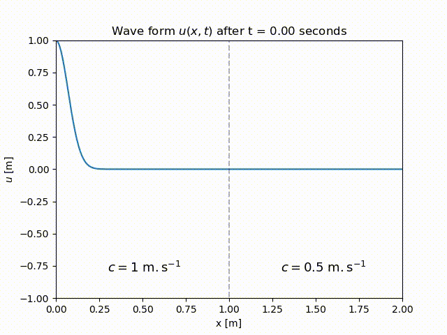
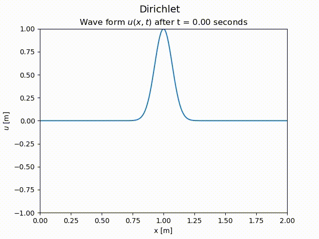
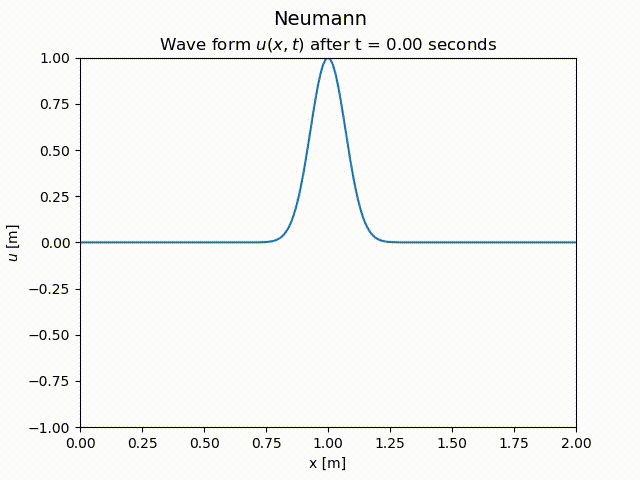
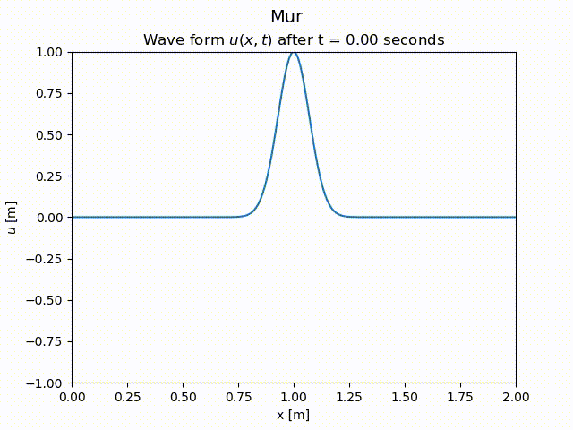
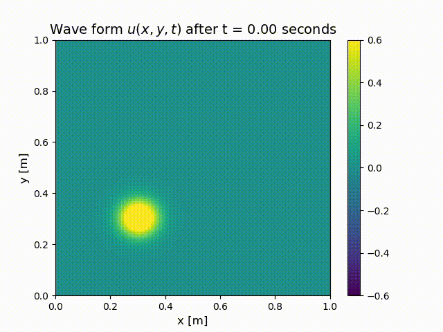

# Wave equation simulations 1D/2D (équation de D'Alembert)
#### To cite this version: 
> Sacha BINDER. Étude de l’observation et de la modélisation des ondes de surface en eau peu profonde. Physique-Informatique.TIPE session 2021.

Python model solving the [wave equations](https://en.wikipedia.org/wiki/Wave_equation) in 1D and 2D. All the process of calculation is based on [finite difference method](https://en.wikipedia.org/wiki/Finite_difference_method). The simulation include a variation of wave's velocity in the spatial domain. Scripts are using [NumPy](https://numpy.org/), [Matplotlib](https://matplotlib.org/) and [SciPy](https://www.scipy.org/) libraries.

### 1D simulation
The script [1D_WAVE-EQ_variable-velocity.py](https://github.com/sachabinder/wave_equations_simulation/blob/main/1D_WAVE-EQ_variable-velocity.py) can be used to simulate several situations :
- Wave propagation at constant speed (left) and variable speed (right) :

    </a>
    </a>

- Wave propagation with several boundary conditions such as [Dirichlet](https://en.wikipedia.org/wiki/Dirichlet_boundary_condition), [Neumann](https://en.wikipedia.org/wiki/Neumann_boundary_condition) and Mur's ([Impedance matching](https://en.wikipedia.org/wiki/Impedance_matching)) :

    </a>
    </a>
    </a>

### 2D simulation
The script [2D_WAVE-EQ_variable-velocity.py](https://github.com/sachabinder/wave_equations_simulation/blob/main/2D_WAVE-EQ_variable-velocity.py) is a two-dimensional generalisation of what was presented previously :

    </a>
        </a>

